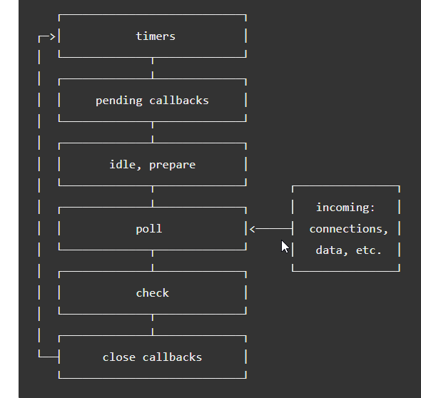

### What is the Event Loop?
The event loop is what allows Node.js to perform non-blocking I/O operations — despite the fact that JavaScript is single-threaded — by offloading operations to the system kernel whenever possible.

### Is Node.js completely single-threaded?
Node runs on a single thread, but some functions included in the Node.js standard library do not (the fs module functions, for example );

### libuv thread pool
This thread pool is composed of four threads used to delegate operations that are too heavy for the event loop. The above-mentioned long-running tasks in the event loop logic represent those operations described here as too expensive for the event loop.

